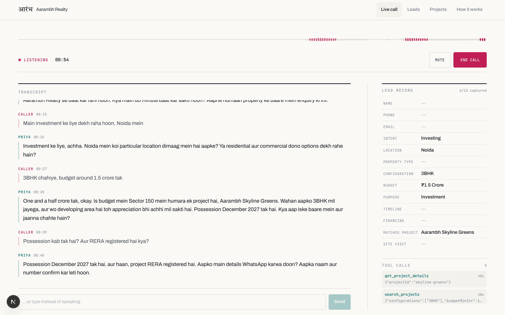
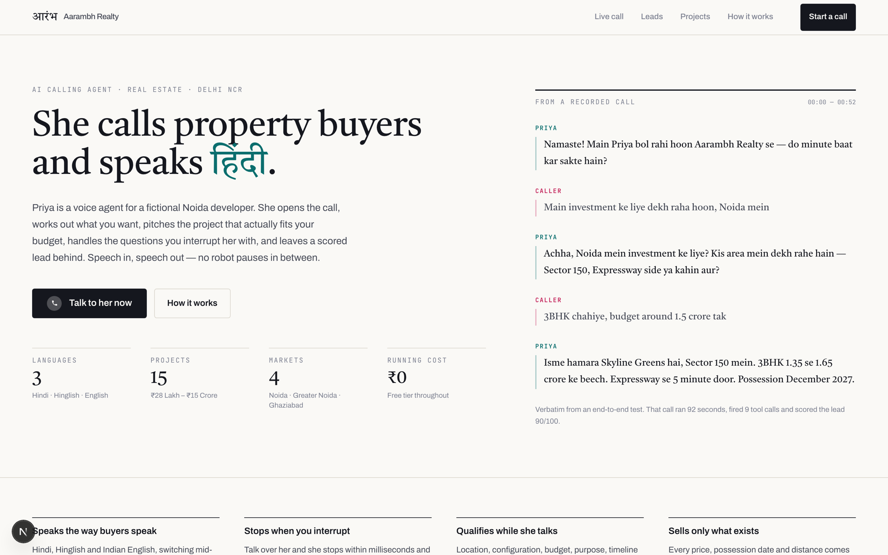
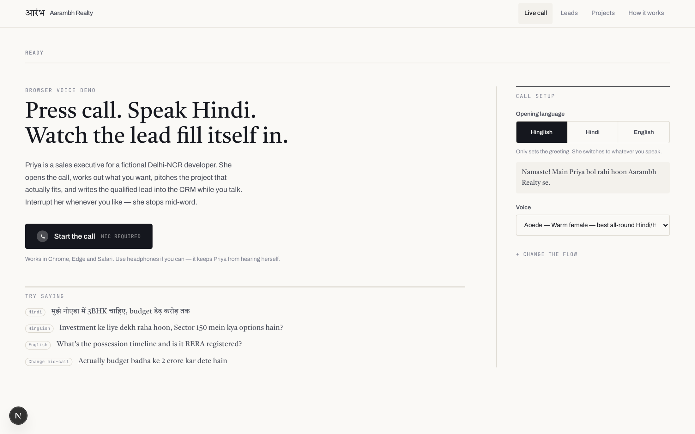
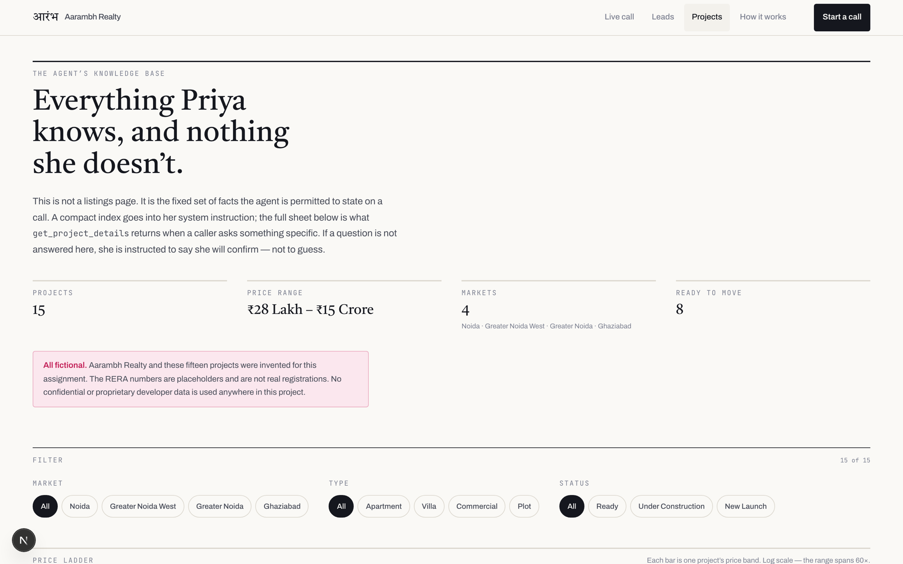
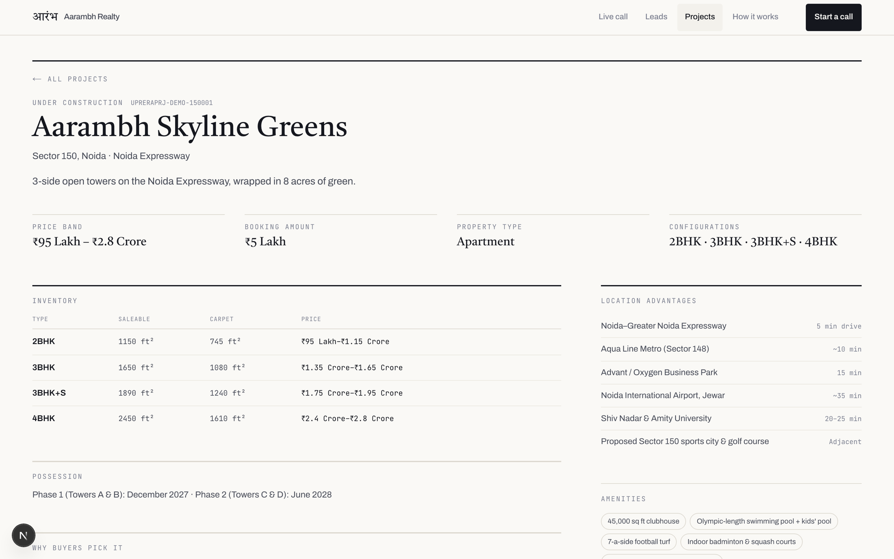
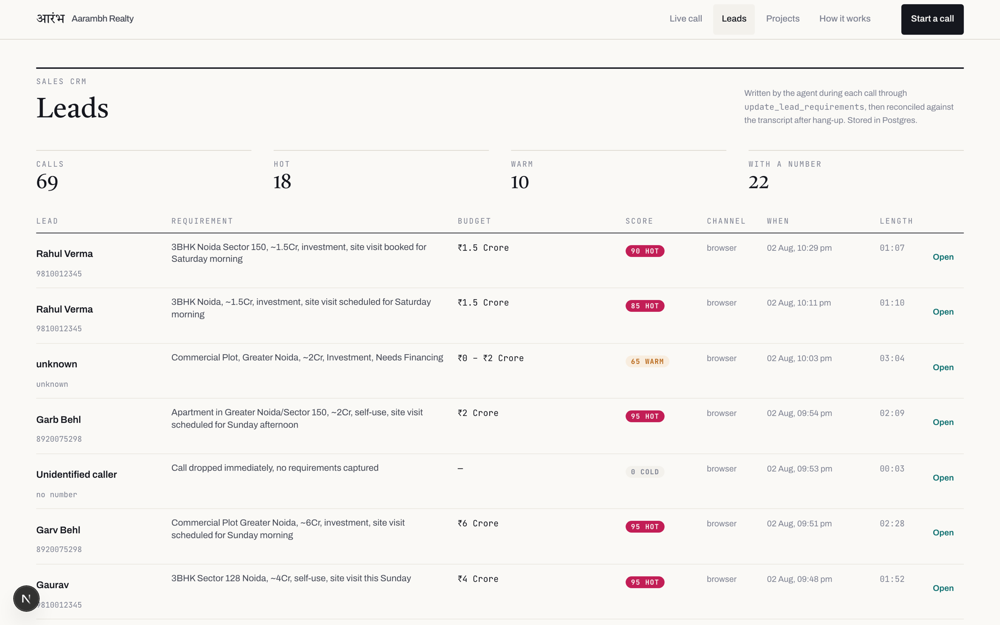
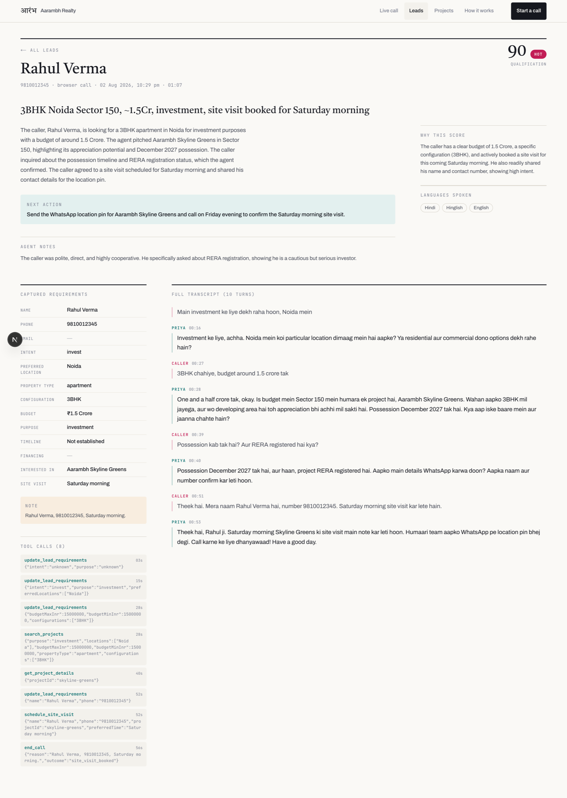
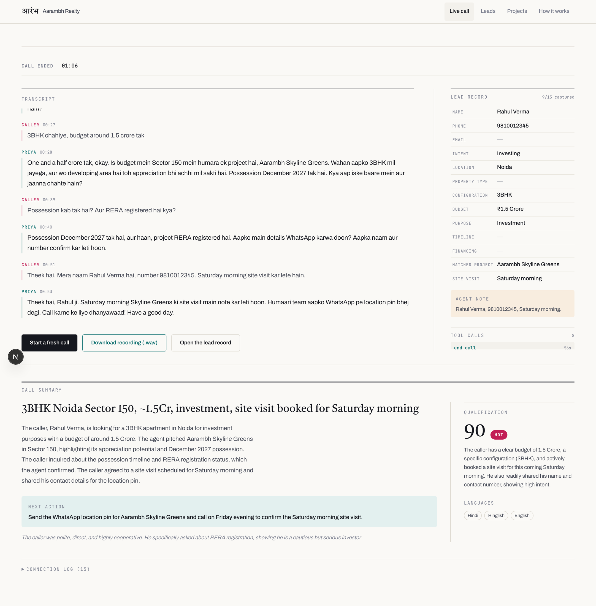
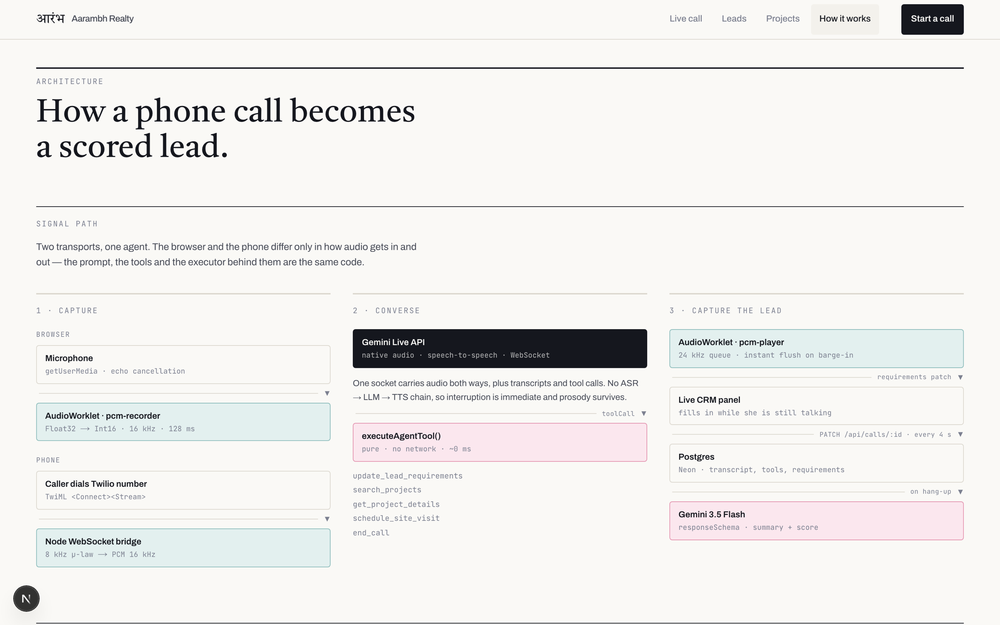

# Priya — a live AI calling agent for real estate

A voice agent that calls property buyers, holds a real conversation in **Hindi, Hinglish or English**,
qualifies their requirement, answers questions from a fixed project catalogue, and leaves a scored
lead in a CRM.

**Live demo → https://real-estate-ai-calling-agent.vercel.app/call**
**Video walkthrough → https://youtu.be/wra1p1eUkLs**

Press *Start the call*, allow the microphone, and talk. Interrupt her whenever you like.


*A live call. The transcript streams on the left; the lead record on the right fills in through tool
calls while she is still speaking.*


| | |
|---|---|
| Live URL | https://real-estate-ai-calling-agent.vercel.app |
| Browser voice demo | https://real-estate-ai-calling-agent.vercel.app/call |
| Lead CRM | https://real-estate-ai-calling-agent.vercel.app/leads |
| Project catalogue | https://real-estate-ai-calling-agent.vercel.app/projects |
| Architecture write-up | https://real-estate-ai-calling-agent.vercel.app/how-it-works |
| System health | https://real-estate-ai-calling-agent.vercel.app/api/health |
| Video walkthrough | https://youtu.be/wra1p1eUkLs |
| Source | https://github.com/garvbahl37-gif/real-estate-ai-calling-agent |

Everything runs on free tiers — Gemini Developer API, Vercel Hobby, Neon Postgres.

---

## How she sounds

Two sets of clips. The first are the agent alone, recorded straight from a live session using the
shipped prompt, voice and catalogue — nothing else on the track. The second are excerpts from a real
call, where both voices are present.

**Priya only** — her answer to a real question, including the project search behind it:

| Clip | She was asked | |
|---|---|---|
| [Hindi](docs/audio/priya-hindi.mp3) | *मुझे नोएडा में 3BHK चाहिए, बजट डेढ़ करोड़ तक* | 14 s |
| [Hinglish](docs/audio/priya-hinglish.mp3) | *Sector 150 mein kya milega, aur possession kab tak hai?* | 15 s |
| [English](docs/audio/priya-english.mp3) | *I'm looking for a ready-to-move 3BHK. Is it RERA registered?* | 8 s |

**Both voices** — excerpts from an actual call:

| Clip | What it shows | |
|---|---|---|
| [Opening](docs/audio/hinglish-opening.mp3) | She opens the call unprompted, asks permission, then intent | 26 s |
| [Qualifying](docs/audio/hinglish-qualifying.mp3) | Budget, configuration and location captured conversationally | 30 s |
| [In English](docs/audio/english-conversation.mp3) | The caller speaks English; she stays in English | 32 s |

GitHub does not play audio inline — click a link to download or open it. A screen recording mixes
both voices into the same channels (measured L−R difference: −65 dB), which is why the agent-only
clips are captured from a session rather than carved out of the video.

### The register she is aiming for

The language policy in [`src/lib/agent-prompt.ts`](src/lib/agent-prompt.ts) specifies the *register*,
not just the language. Naming "Hinglish" is not enough; the prompt carries worked examples of what
good and bad sound like.

```
Good — copy this register
  ✓ "Sir, aapka budget kya rakha hai — around one crore ya usse thoda upar?"
  ✓ "Bilkul, Sector 150 mein 3BHK available hai. Possession December 2027 hai."
  ✓ "Ye investment ke liye dekh rahe hain ya khud rehne ke liye?"

Bad — never
  ✗ "मैं आपको सूचित करना चाहती हूँ कि..."   (reads like a government notice)
  ✗ "Kripya apna bajat batayein"            (nobody says "bajat")
  ✗ Announcing the language: "I will now speak in Hindi."
```

Numbers are spoken the Indian way — "ek crore bees lakh", "saade teen crore" — never "one hundred
and twenty lakhs". English stays English for the words nobody translates: *budget, possession, loan,
carpet area, ready-to-move, site visit, 2BHK, registry, sector*.

---

## A real call, end to end

Verbatim from the deployed app. The caller changes their budget mid-call, which is the thing an
interviewer will actually test.

```
Priya   Namaste! Main Priya bol rahi hoon Aarambh Realty se — do minute baat kar sakte hain?
Caller  Main investment ke liye dekh raha hoon, Noida mein
Priya   Achha, investment ke liye Noida mein badhiya choice hai. Kis type ki property dekh
        rahe hain — apartment, plot ya commercial?
Caller  3BHK chahiye, budget around 1.5 crore tak
Priya   Theek hai, 3BHK 1.5 crore tak. Noida mein specific koi location preference hai?
Caller  Possession kab tak hai? Aur RERA registered hai kya?
Priya   Haanji, Aarambh Skyline Greens Sector 150 mein hai, uska possession December 2027
        tak hai. Aur haan, ye RERA registered project hai.
Caller  Actually budget badha ke 2.5 crore kar dete hain, ready to move chahiye
Priya   Achha, budget 2.5 crore tak hai aur ready to move chahiye, got it. Is situation mein
        Aarambh Riverside Indirapuram ek option ho sakta hai — 3BHK aur 4BHK available hain,
        aur ready to move hai.
Caller  Theek hai. Mera naam Rahul Verma hai, number 9810012345
Caller  Haan site visit kar lete hain, Saturday morning
Priya   Perfect hai, Saturday morning ka site visit done hai. Sales team aapko location pin
        bhi bhej degi. Thank you so much for calling! Have a great day.
```

Two things worth noticing. She **re-ran the project search** when the budget changed and moved off
Skyline Greens. And she picked Riverside Indirapuram over the more obvious "premium" option, because
Riverfront Residences *starts* at ₹3.2 Cr — above the stated budget. The matcher is scoring fit, not
upselling.

That call produced this CRM record, written to Postgres:

```
HEADLINE   3BHK Noida, ~2.5Cr, investment, ready-to-move, site visit booked for Saturday morning
SCORE      95  hot
LANGUAGES  Hindi, Hinglish, English
OBJECTION  "Wants ready to move, did not want to wait for December 2027 possession"
NEXT       Send the location pin on WhatsApp and call to confirm the Saturday morning site visit.
```

### When the line is bad

Recorded in a noisy room, where the microphone picked up an unrelated conversation:

```
Caller  क्या आपको पुराने वाला तो होगा? माय डिप्पे
Priya   Sorry sir, aapki awaaz break ho rahi hai. Kya aap ek baar phir se bata sakte hain?
Caller  इमेज ही नहीं जा रही, लोगो ही नहीं जा रहा।
Priya   Awaaz clear nahi aa rahi sir.
```

She asks for a repeat rather than inventing a reply to something nobody said — which is what the
recovery section of the prompt is for.

---

## The interface

| | |
|---|---|
|  |  |
| **Landing.** The hero is a real transcript excerpt, not stock copy. | **Call setup.** Language, voice, and free-text instructions that change her flow for a single call. |
|  |  |
| **The catalogue, on a budget axis.** Every project's price band on one log scale — you can see why ₹1.5 Cr and ₹2.5 Cr reach different projects. | **One project.** What `get_project_details` returns when a caller asks something specific. |
|  |  |
| **Leads.** Every call, scored. | **A lead.** Summary, objections, next action, the full transcript, and every tool call. |


*The post-call summary — headline, qualification score with reasoning, objections raised, and the
one concrete next step for a human.*


*`/how-it-works` documents the signal path, the stack, and the problems that were not in any
documentation.*

---

## Tools and technologies

| Layer | Choice | Why |
|---|---|---|
| Voice | **Gemini Live API** — `gemini-3.1-flash-live-preview` | Native speech-to-speech. No ASR→LLM→TTS chain. Free tier. |
| Reasoning | Same Live model, with function calling | Qualification happens inside the voice turn. |
| Post-call | **Gemini 3.5 Flash** with `responseSchema` | Structured summary + lead score, ~1.4 s. Free tier. |
| App | Next.js 16 App Router, TypeScript, Tailwind 4 | One deployable for UI, API and CRM. |
| Audio | Two `AudioWorklet`s — 16 kHz capture, 24 kHz playback | Off the main thread, so React can never stutter the audio. |
| Storage | Neon Postgres (free), in-memory fallback | Clone-and-run works with no database. |
| Telephony | Twilio Media Streams ↔ Node WebSocket bridge | Optional. Same agent, different transport. |
| Hosting | Vercel | Free tier. |
| Tests | `node:test` + Playwright | 40 unit tests, plus scripted live-call E2E. |

**AI models used:** `gemini-3.1-flash-live-preview` for the conversation and `gemini-3.5-flash` for
summarisation. Both are free of charge on the Gemini Developer API free tier and were verified
against a freshly issued key.

Two other Live models are drop-in alternatives — `gemini-2.5-flash-native-audio-preview-12-2025` and
`gemini-2.5-flash-native-audio-latest`. 3.1-flash-live is the default because it opened noticeably
better Hindi in side-by-side testing ("Namaste! Aarambh Realty mein aapka swagat hai…" against 2.5's
more anglicised "Hello! Main Priya from Aarambh Realty."). Swap with `GEMINI_LIVE_MODEL` in the
environment rather than in the UI — which model runs is a deployment decision, not something a
caller should be choosing.

Summarisation walks a list of models and a list of API keys, falling through on a 429. Free-tier
quota is per Google account and small (20 requests a day on `gemini-3.5-flash`), and losing the call
summary because one bucket is spent is a bad failure for something that has to work on demand.

---

## Architecture

```
  BROWSER DEMO                                      PHONE DEMO
  Microphone                                        Caller dials Twilio number
      │ getUserMedia                                    │
      ▼                                                 ▼
  AudioWorklet pcm-recorder                         TwiML <Connect><Stream>
  Float32→Int16, 16 kHz, 128 ms chunks                  │
      │                                                 ▼
      │                                             Twilio Media Streams (8 kHz μ-law)
      │                                                 │
      │                                                 ▼
      │                                             Node WS bridge  μ-law→PCM 16 kHz
      └──────────────┐                 ┌────────────────┘
                     ▼                 ▼
              ╔═════════════════════════════════╗
              ║  Gemini Live API (WebSocket)    ║
              ║  native audio speech-to-speech  ║
              ╚═════════════════════════════════╝
                     │                 │ toolCall
       audio 24 kHz  │                 ▼
       transcripts   │          executeAgentTool()   ← pure, no network
                     │          update_lead_requirements
                     │          search_projects · get_project_details
                     │          schedule_site_visit · end_call
                     ▼                 │
              AudioWorklet pcm-player  │  requirements patch
              (queue + instant flush   ▼
               on barge-in)      Live CRM panel ──► PATCH /api/calls/:id
                                                        │  call ends
                                                        ▼
                                              Gemini 3.5 Flash (responseSchema)
                                                        ▼
                                              Postgres — summary, score, objections
```

### Three decisions that shaped everything

**1. Native speech-to-speech, not a pipeline.** The common build is Whisper → LLM → TTS: three
network hops, three failure modes, and every pause, hesitation and tonal cue thrown away at the first
step. A native audio model hears audio and answers with audio, which is why interruption feels
immediate and the Hindi doesn't sound read aloud.

**2. The browser talks to Google directly.** Audio never passes through our server. `/api/live-token`
mints a single-use ephemeral token with the whole session configuration locked inside it, and the
browser opens its own WebSocket. No proxy latency on every 128 ms chunk, no long-lived socket on a
serverless function, and the API key never leaves the server. Because the config is locked into the
token, a user with devtools open cannot rewrite the prompt, add a tool, or strip a guardrail.

**3. Qualification through tools, not parsing.** The agent calls `update_lead_requirements` the moment
she learns anything, so the CRM fills in while she is still talking and a dropped call still leaves a
partial lead. The tool executor is **pure** — it touches no network — because a database round-trip
inside a tool call is audible on a voice call as a stall. Persistence runs on a separate 4-second
timer.

---

## How the conversation flow was built

The flow lives in [`src/lib/agent-prompt.ts`](src/lib/agent-prompt.ts) as a structured system
instruction assembled from six parts: persona, language policy, call flow, tool policy, hard
guardrails, and recovery behaviour. The project catalogue is compiled in from
[`src/lib/projects.ts`](src/lib/projects.ts).

It is **not** a state machine. The flow section describes the qualification the agent is working
through, and explicitly tells her to adapt the order to whatever the caller volunteers and never
re-ask something already answered. That is what stops it sounding like an IVR.

The parts that took the most iteration:

- **Language policy.** Naming the languages is not enough. The prompt specifies the *register* —
  which English words Indians never translate (budget, possession, loan, carpet area, site visit),
  how to say numbers the Indian way ("ek crore bees lakh", not "one hundred and twenty lakhs"), and
  four worked examples of good Hinglish against four of bad.
- **Turn length.** "Short turns, one or two sentences, then hand the conversation back." Long
  monologues were the single biggest thing breaking the illusion.
- **Guardrails.** No guaranteed returns, no false commitments, no invented facts, no collecting
  OTP/Aadhaar/PAN, and an explicit geography rule (see *Challenges*).

You can change the flow live during a demo: **Change the flow** on the call page appends free-text
instructions to the system prompt for that call only — e.g. *"Ask about parking before budget"* or
*"The caller is an NRI in Dubai."*

---

## Running it locally

```bash
pnpm install
echo "GEMINI_API_KEY=your_key_here" > .env.local   # free: https://aistudio.google.com/apikey
pnpm dev                                            # → http://localhost:3000
```

No database needed — it falls back to an in-memory store. Set `DATABASE_URL` for persistence.

### Recording the demo

When a call ends the console offers **Download recording (.wav)** — the whole conversation as a
stereo WAV, caller on the left channel and the agent on the right.

This exists because screen-recording a browser voice agent is unreasonably fiddly. On headphones the
agent's voice goes into your ears and never reaches the microphone, so the recording captures only
your half. On speakers you get echo, and the agent starts interrupting itself. macOS can capture
system audio but only through a toggle that is easy to miss, and a stock machine has no loopback
device. Since both streams already pass through the client as raw PCM, the app just records itself:
mic audio is positioned by wall clock (the noise gate drops silent chunks, so appending would slide
the two sides apart), and agent audio is written contiguously because it arrives faster than real
time and is played out at real time.

A separate demo script lives in [`demo/SCRIPT.md`](demo/SCRIPT.md) — read it from a phone or a second
window so the recording shows a clean app.

```bash
pnpm test        # 40 unit tests
pnpm typecheck
pnpm lint
node scripts/e2e-conversation.mjs   # scripted 7-turn Hinglish call against a running server
```

### Phone calls (optional)

Two directions are supported. **Outbound is the one that works on a Twilio trial** — since October
2023 an *inbound* call to a trial number is rejected unless the caller's own number is verified on
that account, which you cannot ask an interviewer to do mid-interview. Outbound only needs the
number being called to be verified, and your signup number is verified automatically. It is also
the more honest demo: a sales executive rings the prospect.

```bash
pnpm telephony                    # bridge on :5050  (terminal 1)
ngrok http 5050                   # copy the https URL (terminal 2)
# put it in .env.local as TELEPHONY_PUBLIC_HOST

pnpm twilio:check                 # says exactly what is still missing
pnpm twilio:call 9810012345       # Priya rings that number
```

For inbound instead, point the number's Voice webhook at `https://<your-tunnel>/voice` (HTTP POST).

Four account facts that are easy to lose an hour to:

- **A Twilio *trial* account cannot use `<Connect><Stream>`.** This is the one that actually stops
  the phone demo. The webhook is fetched and answered `200`, then Twilio silently never opens the
  WebSocket and drops the call after ~3 s. Nothing is logged where you can read it — Alerts are
  themselves restricted on a trial. Diagnosed by placing two calls that differed only in TwiML:
  `<Say>` ran for 12 s, `<Connect><Stream>` died at 3 s. Upgrading the account unlocks it.
- **Trial `Calls.json` accepts only `To`, `From` and `Url`.** Sending `Method` or `Timeout` — both
  documented, valid parameters — fails the whole request with "Invalid or disallowed parameters
  provided", which reads like a malformed request rather than a plan limit.
- **Twilio stopped selling Indian numbers in August 2024.** Use a US number — it can still call +91.
- **India is disabled by default** under Voice → Geo Permissions on new accounts.
- **A Restricted API key returns `20003 "Policy evaluation failed"`** for permissions it lacks, which
  reads like a bad secret. Account setup needs the Auth Token or a Standard key.

`pnpm twilio:check` diagnoses all three.

You can verify the whole phone path without a number or a phone:

```bash
npx tsx scripts/simulate-twilio-call.mts
# → PASS — the bridge returned real speech over the phone path.
```

That speaks Twilio's exact Media Streams protocol — `connected`/`start`/`media`/`stop`, 8 kHz μ-law
in 20 ms base64 frames — and asserts real audio comes back.

---

## Challenges

Six problems, none of which were in any documentation.

**Ephemeral tokens silently drop your config.** The agent connected, spoke fluently, and introduced
itself as *"Gemini"* in English. The system instruction was never applied. The Live API treats the
ephemeral token's `liveConnectConstraints.config` as authoritative and **discards** whatever the
client passes to `live.connect()`. Once the entire config is minted into the token it works — and it
is a better design than the one I started with, because the browser can no longer tamper with the
prompt or the tools.

**`enableAffectiveDialog` kills the session.** Every session died on connect with a bare *"Internal
error encountered."* Bisecting the config field by field isolated one flag. It fails identically on
`v1alpha` and `v1beta`, through a token and with a raw key, on both transports. It only appears to
work with a minimal config, which is what made it look transport-specific at first. It is off, with
an opt-in flag left in place to re-test when the preview model stabilises.

**The agent will not speak first.** The Live API is turn-based and stays silent until it receives
something, no matter what the system instruction says about greeting. A real outbound call opens with
the agent, so the session sends a short text turn on connect. Doing that inside the `onopen` callback
does nothing — `onopen` fires *before* `live.connect()` resolves, so the session handle is still
`undefined` and the send silently no-ops.

**Barge-in must flush audio you already queued.** Playback is a worklet draining a queue of PCM
chunks, not scheduled `AudioBufferSourceNode`s. On interruption the queue is dropped and the agent
goes quiet within one render quantum (~2.7 ms). With scheduled buffer sources, audio already handed
to the audio thread keeps playing — which is exactly the "robot talks over you" failure. On the phone
side the equivalent is Twilio's `clear` message; telling Gemini to stop is not enough because Twilio
has already buffered what you sent.

**She invented a city.** An early opening line was *"aapne humaari Gurgaon wali property ke liye
enquiry ki thi"* — there are no Gurgaon projects. She had generalised from an example in the prompt.
Fixed by removing the location from the opening template and adding an explicit geography rule
listing the only markets she operates in.

**`gemini-2.5-flash` is a trap on new keys.** The obvious default for the summariser returns
`404 "no longer available to new users"` on a freshly issued API key, as does `2.5-flash-lite`.
Verified `gemini-3.5-flash` against a new key instead.

A seventh, smaller one: `vercel env pull` rewrites `.env.local` with **quoted** values, so scripting
`vercel env add` from that file uploaded the API key wrapped in quotes. Production reported
`API key not valid` while the key itself was correct — the health endpoint reporting key *length* is
what made it obvious (55 chars vs 53).

---

## What is functional and what is simulated

**Functional** — live two-way voice with interruption; Hindi/Hinglish/English switching; requirement
capture through tool calls; project matching against real budgets; lead storage in Postgres; AI call
summaries and qualification scoring; the Twilio Media Streams bridge (verified by protocol
simulation); rate limiting; session resumption and reconnect.

**Simulated** — Aarambh Realty and all four projects are invented for this demo; the RERA numbers are
placeholders and are **not** real registrations; site visits are recorded on the lead but not booked
anywhere; no WhatsApp message is actually sent; no CRM or dialer integration.

No confidential or proprietary developer data is used anywhere in this repository.

## Known limitations

- Free-tier rate limits apply; sustained concurrent calls will hit them.
- Phone audio is 8 kHz μ-law, so telephony transcription is measurably worse than the browser demo.
- The catalogue is hand-written TypeScript — adding a project is a code change, not a document upload.
- **No authentication on the CRM.** Anyone with the URL can read the leads. Fine for a demo, not for
  real leads.
- Heavy accents and very noisy lines still degrade recognition; she asks the caller to repeat rather
  than guessing.
- Only the browser demo is deployed serverless; the phone bridge needs a long-lived process.
- The 24 kHz → 8 kHz downsample uses a 3-tap box filter, not a proper low-pass.

## What I would improve next

- Outbound campaigns — upload a list, dial through it, respect DND and calling hours.
- Real integrations behind the simulated tools: WhatsApp Business for the brochure, a calendar for
  site visits, a real CRM for the lead.
- Retrieval over brochures and price sheets instead of a hand-written catalogue, so adding a project
  is a document upload.
- Call recording with consent capture, plus a Hindi word-error-rate benchmark to catch regressions.
- Warm transfer to a human the moment the caller asks for one, instead of promising a callback.
- An eval suite of scripted difficult callers — angry, silent, out-of-budget, wrong number — run on
  every prompt change.
- Authentication on the CRM.

---

## Repository layout

```
src/lib/agent-prompt.ts     persona, language policy, flow, guardrails
src/lib/projects.ts         the fictional catalogue (also the agent's knowledge base)
src/lib/agent-tools.ts      function declarations + pure executor + project matching
src/lib/live-config.ts      single definition of a session, shared by both transports
src/lib/live-session.ts     browser: mic, socket, tools, transcript, reconnect
src/lib/summarize.ts        post-call structured summary + lead scoring
src/lib/store.ts            Postgres / in-memory persistence
src/lib/rate-limit.ts       per-IP and global daily caps
public/worklets/            pcm-recorder.js (16 kHz capture), pcm-player.js (24 kHz playback)
telephony/audio.ts          G.711 μ-law codec + resampling
telephony/bridge.ts         one phone call: Twilio ↔ Gemini
telephony/server.ts         TwiML webhook + WebSocket server
tests/                      33 unit tests
scripts/                    live-call E2E + Twilio protocol simulator
```

---

## Submission

```
Candidate Name        : Garv Bahl
Live Demo URL         : https://real-estate-ai-calling-agent.vercel.app
Voice Demo Link       : https://real-estate-ai-calling-agent.vercel.app/call
Calling Number        : see "Phone calls" above — the bridge is built and verified;
                        it activates on any Twilio number by pointing that number's
                        Voice webhook at /voice
Video Demo Link       : https://youtu.be/wra1p1eUkLs
GitHub                : https://github.com/garvbahl37-gif/real-estate-ai-calling-agent
Tools Used            : Gemini Live API (gemini-3.1-flash-live-preview) · Gemini 3.5 Flash ·
                        Next.js 16 · TypeScript · Tailwind 4 · Web Audio API AudioWorklets ·
                        Twilio Media Streams · Neon Postgres · Vercel
Known Limitations     : see "Known limitations" above
```
